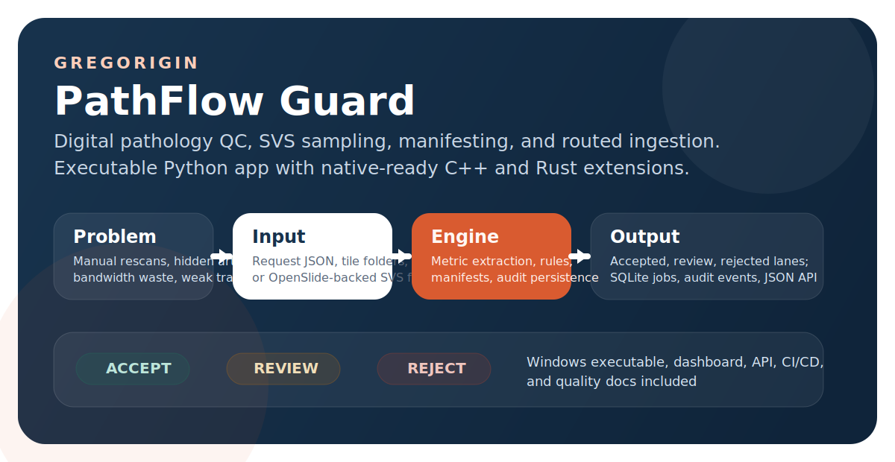
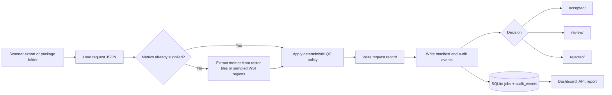
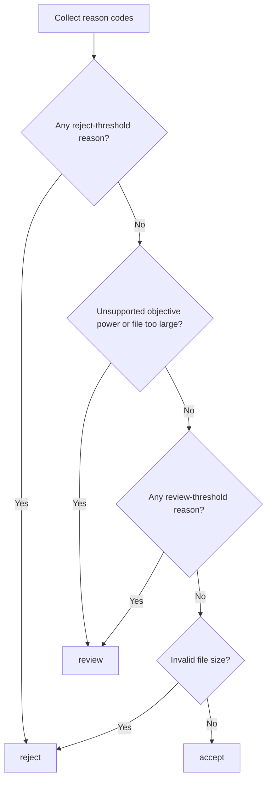

<p align="center">
  <a href="https://www.gregorigin.com">
    
  </a>
</p>

<p align="center">
  
  
  
  
  
  
</p>

# PathFlow Guard

PathFlow Guard is a digital pathology intake and quality-control project built around a practical 2026 problem: too much manual QC, too many avoidable rescans, too much wasted transfer and storage on bad slide packages, and not enough deterministic evidence when an ingest decision needs to be reviewed later.

The repo centers on an executable Python application that screens pathology slide packages before cloud upload, extracts QC metrics from raster tiles or OpenSlide-backed whole-slide images, assigns an `accept`, `review`, or `reject` decision, writes audit artifacts, and stages packages into routed workspace lanes. Around that runnable core, the repository also includes a C++ QC module, a Rust integrity attestor, Azure infrastructure scaffolding, CI/CD, and regulated-development documentation.

> [!IMPORTANT]
> PathFlow Guard is workflow-support software, not autonomous diagnosis.

**Quick links:** [Illustrated online manual @ GregOrigin](https://gregorigin.com/PathFlowGuard/) | [Architecture](docs/architecture.md) | [Research basis](docs/research.md) | [Software lifecycle](docs/quality/software-lifecycle.md) | [Security](SECURITY.md) | [Contributing](CONTRIBUTING.md) | [Changelog](CHANGELOG.md)

## Table of contents

- [Why this project exists](#why-this-project-exists)
- [What PathFlow Guard does](#what-pathflow-guard-does)
- [System flow](#system-flow)
- [Quick start](#quick-start)
- [Sample request](#sample-request)
- [Command reference](#command-reference)
- [Decision policy](#decision-policy)
- [Dashboard and API](#dashboard-and-api)
- [Workspace model](#workspace-model)
- [OpenSlide and whole-slide support](#openslide-and-whole-slide-support)
- [Native and cloud components](#native-and-cloud-components)
- [Build and release workflow](#build-and-release-workflow)
- [Verification and engineering discipline](#verification-and-engineering-discipline)
- [Quality and regulatory framing](#quality-and-regulatory-framing)
- [Repository layout](#repository-layout)
- [Current limitations](#current-limitations)
- [Further documentation](#further-documentation)
- [License and security](#license-and-security)

## Why this project exists

Digital pathology still has a real intake problem:

- low-quality slides can still leak into downstream analysis if QC is inconsistent
- good slides can still be rescanned unnecessarily when triage criteria are weak
- whole-slide image payloads remain large enough that failed uploads and avoidable storage cost matter
- pathology operations remain under workload pressure, making deterministic workflow tooling useful
- connected medical software faces tighter cybersecurity expectations

PathFlow Guard addresses that gap at the edge, before bad packages become cloud cost, operational delay, or downstream AI noise.

## What PathFlow Guard does

| Area | Current implementation |
| --- | --- |
| Runnable application | Python orchestrator with CLI, local dashboard, JSON API, SQLite persistence, and package routing |
| Imaging support | Raster tile extraction plus OpenSlide-based whole-slide sampling for `.svs` and other recognized WSI formats |
| Routing | `accept`, `review`, and `reject` lanes with request records, audit JSON, and deterministic manifests |
| Windows packaging | Standalone `PathFlowGuard.exe` build flow via PyInstaller |
| Native modules | C++ QC core and Rust attestor are present as companion modules and CI targets |
| Cloud scaffolding | Azure deployment skeleton for storage, queueing, secrets, and worker hosting |
| Quality artifacts | IEC 62304 / ISO 13485 / ISO 14971 style lifecycle, design-control, risk, and traceability documents |

The runnable end-to-end workflow today is the Python orchestrator. The C++ and Rust components are included as production-oriented extensions and verification targets, not as the default operator runtime.

## System flow

<p align="center">
  
</p>



PathFlow Guard follows a deliberately linear pipeline:

1. ingest a request and resolve its package context
2. extract QC metrics if they were not supplied already
3. evaluate explicit thresholds and generate reason codes
4. persist a request record, manifest, and audit events
5. copy the package into the routed workspace lane
6. expose results in SQLite, the dashboard, and the JSON API

That structure keeps the application inspectable and reviewable. Every decision can be reconstructed from saved request data, extracted metrics, persisted outputs, and audit events.

## Quick start

### Prerequisites

- Python 3.12 or newer
- Windows 11 or another environment supported by your Python and OpenSlide toolchain
- For real whole-slide extraction on non-Windows systems, the native OpenSlide library installed before Python dependencies

> [!NOTE]
> On Windows, use `py -3.12` if `python` resolves to the Microsoft Store alias instead of the real interpreter.

### Run from source

```powershell
cd python\orchestrator
py -3.12 -m venv .venv
. .\.venv\Scripts\Activate.ps1
py -3.12 -m pip install --upgrade pip
py -3.12 -m pip install -e ".[dev]"
py -3.12 -m unittest discover -s tests -v
pathflow-guard doctor
pathflow-guard init --workspace .\runtime
pathflow-guard demo --workspace .\runtime
pathflow-guard report --workspace .\runtime
pathflow-guard serve --workspace .\runtime --port 8765
```

Then open `http://127.0.0.1:8765`.

### Minimal extraction example

```powershell
pathflow-guard extract C:\slides\case_42.svs
```

If the request JSON omits metrics but includes `package_path`, the pipeline resolves the package and extracts metrics before evaluation.

### Fastest local smoke path

```powershell
cd python\orchestrator
pathflow-guard init --workspace .\runtime
pathflow-guard demo --workspace .\runtime
pathflow-guard serve --workspace .\runtime --port 8765
```

### Packaged Windows executable

From `python\orchestrator`:

```powershell
.\build_windows.ps1
```

This produces:

```text
python\orchestrator\dist\PathFlowGuard.exe
```

Example packaged usage:

```powershell
.\dist\PathFlowGuard.exe doctor
.\dist\PathFlowGuard.exe init --workspace .\runtime
.\dist\PathFlowGuard.exe demo --workspace .\runtime
.\dist\PathFlowGuard.exe report --workspace .\runtime
.\dist\PathFlowGuard.exe serve --workspace .\runtime --port 8765
.\dist\PathFlowGuard.exe extract C:\slides\case_42.svs
```

The build script also supports packaged smoke testing:

```powershell
.\build_windows.ps1 -SmokeTest
```

## Sample request

The repository ships request samples for each route outcome. A minimal accept-case request looks like this:

```json
{
  "case_id": "CASE-2026-101",
  "slide_id": "SLIDE-101",
  "site_id": "SITE-EDGE-ALPHA",
  "objective_power": 40,
  "file_bytes": 0,
  "package_path": "../packages/accept-package",
  "notes": "Expected accept lane sample."
}
```

Key request behavior:

- `case_id`, `slide_id`, and `site_id` are required
- `objective_power` defaults to `40`
- `file_bytes` can be auto-resolved from disk when a package path is present
- `focus_score`, `tissue_coverage`, and `artifact_ratio` are required unless they can be extracted
- relative `package_path` values are resolved from the request file location
- the resolved request is what gets written into `runtime/requests/`

## Command reference

| Command | Purpose |
| --- | --- |
| `pathflow-guard doctor` | Report runtime capabilities for source installs and packaged builds |
| `pathflow-guard init --workspace .\runtime` | Create workspace directories and the SQLite database |
| `pathflow-guard evaluate samples\requests\accept.json` | Evaluate a request without persisting a job |
| `pathflow-guard extract samples\packages\accept-package` | Extract focus, tissue, and artifact metrics from tiles or whole-slide input |
| `pathflow-guard ingest samples\requests\accept.json --workspace .\runtime` | Evaluate, persist, manifest, route, and audit a request |
| `pathflow-guard demo --workspace .\runtime` | Seed the workspace with accept, review, and reject examples |
| `pathflow-guard report --workspace .\runtime` | Print summary counts and recent jobs as JSON |
| `pathflow-guard serve --workspace .\runtime --port 8765` | Start the local dashboard and API |

## Decision policy

The current rule engine is deterministic and intentionally conservative.

| Signal | Review threshold | Reject threshold | Current behavior |
| --- | --- | --- | --- |
| `focus_score` | `< 55.0` | `< 35.0` | Borderline focus routes to review, clearly poor focus rejects |
| `tissue_coverage` | `< 0.10` | `< 0.03` | Low tissue presence is escalated before upload |
| `artifact_ratio` | `> 0.12` | `> 0.25` | Artifact-heavy slides move to review or reject |
| `objective_power` | not in `(20, 40)` | n/a | Unsupported objective powers route to review |
| `file_bytes` | `> 5 GiB` | `<= 0` | Oversized packages route to review, invalid size rejects |

Reason codes are persisted with every job. This matters for auditability, trending, CAPA, and later threshold tuning.



## Dashboard and API

The local web server exposes a compact but useful operator surface:

- `/` shows the dashboard, summary cards, recent jobs, and a manual ingest form
- `/jobs/<job_id>` shows a human-readable detail view of one stored job
- `/api/jobs` returns recent jobs as JSON
- `/api/jobs/<job_id>` returns one job as JSON
- `/healthz` returns a basic status probe
- `POST /ingest` powers the dashboard's manual ingest form

The dashboard and API are backed by the same pipeline and repository layer as the CLI, so behavior stays aligned across manual and scripted usage.

## Workspace model

<p align="center">
  
</p>

Each ingest produces inspectable artifacts:

```text
runtime/
  accepted/
  review/
  rejected/
  requests/
  manifests/
  audit/
  pathflow_guard.db
```

- `requests/` stores the resolved request JSON used for evaluation
- `manifests/` stores deterministic manifests for package content
- `audit/` stores per-job audit event JSON alongside the SQLite audit event table
- `accepted/`, `review/`, and `rejected/` store copied payloads by decision lane
- `pathflow_guard.db` stores jobs and audit events for reporting and UI/API retrieval

This layout is simple on purpose: operators can inspect it directly, while automation can still query the same state through SQLite and JSON surfaces.

## OpenSlide and whole-slide support

PathFlow Guard supports OpenSlide-backed whole-slide files in addition to raster tiles.

When a request points to an `.svs` file, or to a directory containing one, the extractor:

- discovers the slide path
- loads it through OpenSlide
- reads slide bounds from metadata when available
- builds a deterministic grid of representative `256x256` tile requests
- calls `read_region()` on those tile locations
- computes `focus_score`, `tissue_coverage`, and `artifact_ratio`
- feeds the extracted metrics into the same policy engine used for raster inputs

Supported WSI extensions currently include:

- `.bif`
- `.mrxs`
- `.ndpi`
- `.scn`
- `.svs`
- `.svslide`
- `.vms`
- `.vmu`

The extractor also treats `.tif` and `.tiff` as whole-slide candidates only when OpenSlide recognizes them as such.

## Native and cloud components

### Python orchestrator

Current executable application:

- CLI entrypoint
- request loading and context resolution
- raster and whole-slide metric extraction dispatch
- deterministic rule engine
- manifest generation and package routing
- SQLite repository
- local dashboard and API

### C++ QC core

Repository role:

- native reference implementation for metric computation and future benchmarking
- natural location for performance validation against representative edge hardware

### Rust attestor

Repository role:

- companion integrity tool for deterministic manifest verification
- narrow place to harden integrity-sensitive behavior without expanding the shipping Python runtime

### Azure skeleton

Repository role:

- storage, queueing, secret management, and stateless worker hosting surfaces
- cloud continuation path for accepted jobs without changing the edge-side decision model

## Build and release workflow

Tagged releases are designed to be built through GitHub Actions.

- CI validates the Python, C++, and Rust code paths on pushes and pull requests
- the Windows packaging job builds `PathFlowGuard.exe` and smoke-tests the packaged executable
- the release workflow is intended to upload `PathFlowGuard.exe`, a release zip, and `SHA256SUMS.txt`
- if signing secrets are configured, the Windows executable can be signed before publication

## Verification and engineering discipline

The repo includes a multi-language CI workflow and corresponding local verification paths.

Current verification surfaces:

- Python linting with Ruff
- Python unit tests
- source-install smoke test via `pathflow-guard doctor`
- Windows packaged-build smoke test for `PathFlowGuard.exe`
- C++ configure, build, and test
- Rust format check, Clippy, and tests

The design intent is broader than just green builds:

- keep testable language boundaries
- enforce review for changes that affect safety, security, or behavior
- keep quality-system docs versioned with implementation changes
- preserve explicit traceability between requirements, risk, code, and verification
- verify the released Windows artifact rather than only the source tree

## Quality and regulatory framing

PathFlow Guard is not a regulatory submission. It is a concrete implementation scaffold designed to show how a medical software project can be organized with regulated-development discipline.

The repository includes:

- [IEC 62304-style software lifecycle framing](docs/quality/software-lifecycle.md)
- [ISO 13485-style design-control framing](docs/quality/design-controls.md)
- [ISO 14971-style risk framing](docs/quality/risk-register.md)
- [requirement-to-implementation traceability](docs/quality/traceability-matrix.md)
- [system architecture, reliability, and security posture](docs/architecture.md)

Initial safety positioning is workflow-support software, not diagnosis. The current structure intentionally routes uncertainty to manual review rather than autonomous acceptance.

## Repository layout

```text
PathFlowGuard2026/
  .github/
    workflows/
  cpp/
    qc-core/
  docs/
    assets/
    quality/
    site/
  infra/
    azure/
  python/
    orchestrator/
  rust/
    attestor/
  CHANGELOG.md
  CONTRIBUTING.md
  LICENSE
  README.md
  SECURITY.md
```

## Current limitations

- the current QC metrics are heuristic first-version metrics, not clinically validated production algorithms
- the local executable path is Python-centered; C++ and Rust are companion components, not the default runtime path yet
- no real proprietary scanner slide is bundled in the repository, so SVS support is implemented and tested without shipping an actual vendor file
- the Azure portion is scaffolding, not a fully deployed cloud service
- optional Windows code signing requires repository secrets in GitHub Actions
- the project is meant to demonstrate engineering judgment, architecture, and executable workflow quality, not claim medical-device clearance

## Further documentation

- [Illustrated HTML manual](docs/site/index.html)
- [Architecture notes](docs/architecture.md)
- [Research basis and references](docs/research.md)
- [Software lifecycle](docs/quality/software-lifecycle.md)
- [Design controls](docs/quality/design-controls.md)
- [Risk register](docs/quality/risk-register.md)
- [Traceability matrix](docs/quality/traceability-matrix.md)
- [Security policy](SECURITY.md)
- [Contributing guide](CONTRIBUTING.md)
- [Changelog](CHANGELOG.md)

## License and security

Researched and created by Andras Gregori @ [GregOrigin.com](https://gregorigin.com/). This repository is licensed under [Apache 2.0](LICENSE).

Security reports should use GitHub's private vulnerability reporting flow as described in [SECURITY.md](SECURITY.md).
